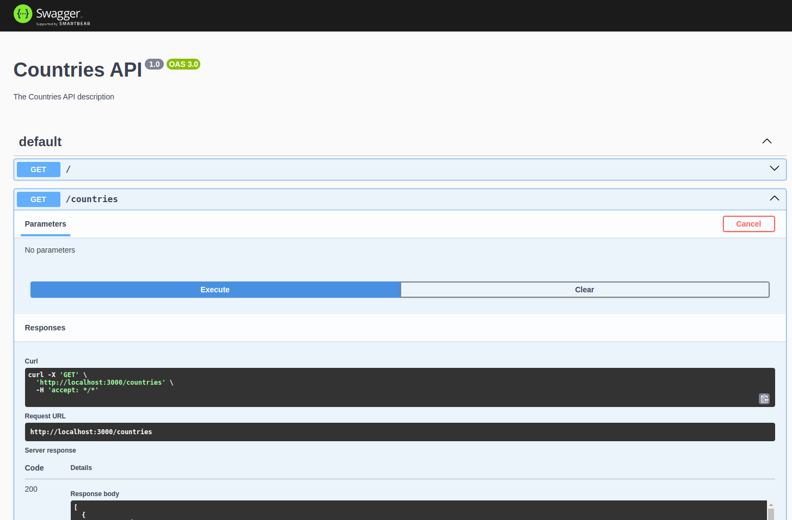
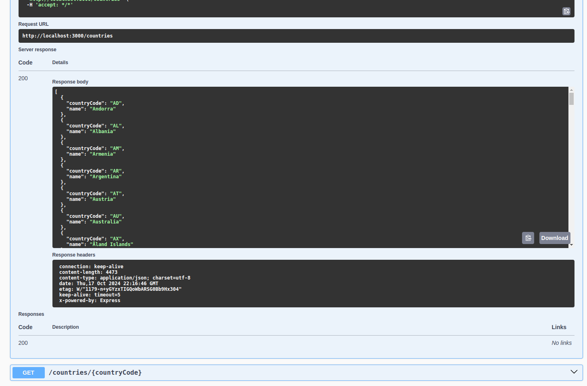
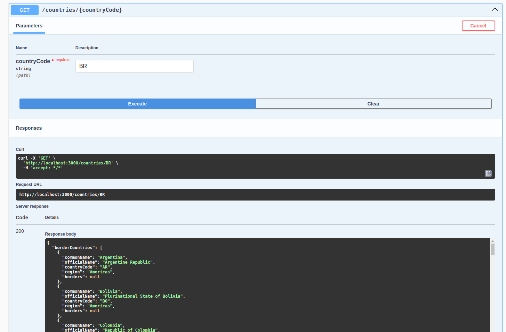
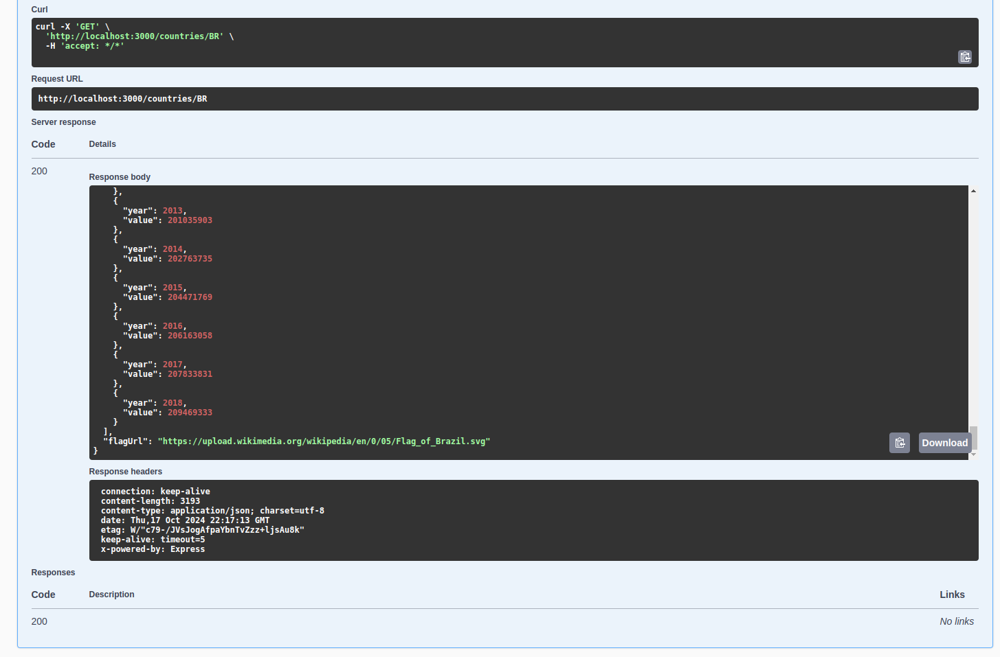

# Countries API

This project is a NestJS-based backend application that provides information about countries. It fulfills the requirements of the Full-Stack JS engineer test assessment for the Country Info App.

## Features

- Endpoint to get available countries
- Endpoint to get detailed country information including:
  - Border countries
  - Population data
  - Flag URL

## Requirements Fulfilled

1. **Backend Tech Stack**: Node.js with NestJS
2. **Get Available Countries Endpoint**: Implemented in `CountriesService` and `CountriesController`
3. **Get Country Info Endpoint**: Implemented in `CountriesService` and `CountriesController`
4. **Environment Variables**: Configured using `@nestjs/config`
5. **Code Quality**: ESLint and Prettier are set up
6. **Documentation**: This README and Swagger API documentation
7. **Testing**: Unit tests and e2e tests are implemented
8. **Error Handling**: Implemented using NestJS exceptions

## Installation
```bash
npm install
```

## Development

```bash
npm run start
```

## Watch mode

```bash
npm run start:dev
```

## Production mode

```bash
npm run start:prod
```

## Testing

### Unit tests

```bash
npm run test
```

### e2e tests

```bash
npm run test:e2e
```

### Test coverage

```bash
npm run test:cov
```

## Swagger API documentation

After starting the application, you can access the Swagger API documentation at:

```bash
http://localhost:3000/api
```

### Swagger Documentation Screenshots

#### API Overview


#### Get Available Countries


#### Get Country Info


#### Get Country Info Response


## Environment Variables

Create a `.env` file in the root directory and add the following:

```bash
PORT=3000
```

## License

This project is [MIT licensed](LICENSE).
