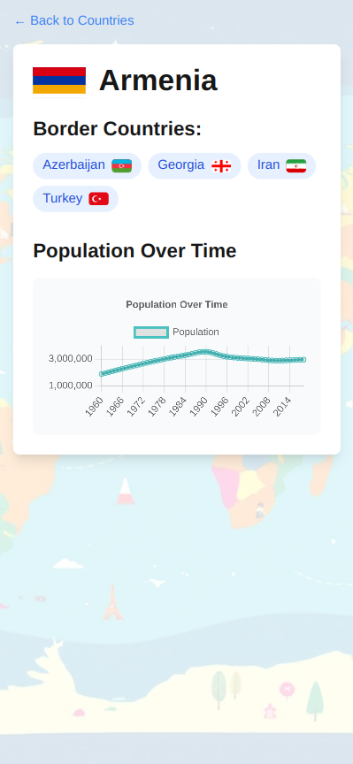

# Country Info App - Frontend

This is the frontend application for the Country Info App, built with Next.js and React. It allows users to view a list of countries and detailed information about each country, including bordering countries and population data.

## Features

- List of countries with flags
- Detailed country information page
- Interactive population chart
- Responsive design
- Server-side rendering with Next.js

## Screenshots

### Home Page


### Countries List


### Country Details




## Prerequisites

Before you begin, ensure you have the following installed:

- Node.js (v14 or later)
- npm (v6 or later)

## Getting Started

1. Install dependencies:

   ```
   npm install
   ```

2. Set up environment variables:

   - Copy the `.env.example` file to a new file named `.env.local`:
     ```
     cp .env.example .env.local
     ```
   - Edit `.env.local` and set the `NEXT_PUBLIC_API_URL` to your backend API URL.

3. Run the development server:

   ```
   npm run dev
   ```

4. Open [http://localhost:3000](http://localhost:3000) in your browser to view the application.

## Available Scripts

In the project directory, you can run:

- `npm run dev`: Runs the app in development mode
- `npm run build`: Builds the app for production
- `npm start`: Runs the built app in production mode
- `npm run lint`: Lints the codebase
- `npm run format`: Formats the codebase using Prettier
- `npm run format:check`: Checks if the codebase is formatted correctly

## Project Structure

```bash
src/
├── app/ # Next.js app router pages
├── components/ # React components
├── lib/ # Utility functions and API calls
└── ...
public/ # Static assets
```

## Styling

This project uses Tailwind CSS for styling. The main stylesheet is located at `src/app/globals.css`.

## Environment Variables

The following environment variables are required:

- `NEXT_PUBLIC_API_URL`: The URL of the backend API

## API Integration

API calls are made using Axios. The API integration is handled in `src/lib/api.ts`.

## Code Quality

This project uses ESLint for linting and Prettier for code formatting. Configuration files for both tools are included in the root directory.

## License

This project is licensed under the MIT License - see the [LICENSE](LICENSE) file for details.
